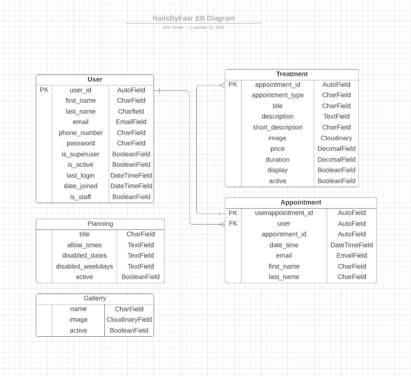

# Smart House Inventory

## Portfolio Project 4: Full Stack Toolkit


This project is built as part of the Code Institute Full Stack Software Development course. For this course, Dirk Ornee had to built a fourth Portfolio Project. Since his cousin just started a nail salon and was in dire need of a website with booking capabilities, what better way to build a fourth Portfolio Project and help somebody at the same time! Important note: this is not the actual live version that is used by the nail salon, this version is used purely as a project for Code Institute and users can book appointments freely (you won't suddenly be expected to show up at a nail salon).

## Live Site

[NailsbyFaar](https://nailsbyfaar.herokuapp.com/)

## Github Repository

[PortfolioProjectFour](https://github.com/DOdrums/PortfolioProjectFour)


## UX

### Business Goals

The main goal of this project is to give a user the ability to book appointments at the NailsbyFaar nail salon. User should also get a good feeling for the salon and know what to expect from the treatments. If the user books an appointment, they should be able to make updates to their appointments in a user dashboard.

### Target Audience

It might be obvious, but the target audience of this website is people who love getting their nails done! There isn't much more to be said about it, it can be people who go get their nails done for the first time, people who've gotten their nails done hundreds of times or people who are recurring customers at this specific salon. As long as they like pretty nails!

### User Stories

User stories were written together with salon owner and were all written to fit within the agile methodology. They have the following criteria:

* title
* clear description
* acceptance criteria
* tasks, when acceptance criteria alone weren't clear enough
* story points
* epic
* priority (must have, should have, could have)

In the picture below you can see an example of the user stories before work on the project was started:


And the user stories board after finishing the project:


As you can see, only one user story was left, which didn't fit in the scope of the project in the end. Since it was a 'could have' the decision to leave it out was easily made. To view all the user stories in detail, visit the project page: [user stories board](https://github.com/users/DOdrums/projects/3/views/1)


### Structure of the app

The app is designed to have a natural flow, with a strong focus on the booking functionality. Most pages include booking buttons or calls to book an appointment. The home page specifically features a booking button right on top, so a user doesn't have to scroll at all to make an appointment. This is especially handy and necessary for recurring customers, who will be the gross of the clientele.

### Logic/Database Diagram

The logic of the app was thought out by making a database diagram, to visualize which objects will need to be created for this app to be functional and how they will be connected to each other. Notably, the initial database diagram was incomplete, which was discovered during production of the app. See the images below:

Initial database diagram:


Updated database diagram:



### Color Scheme

The color scheme of the salon itself was used, see the image below. It creates a very feminine and calm look, which perfectly fits the nail polish theme.


### Features

The app is divided into two main sections, 'show/edit inventory' and 'add a product'. These two sections together hold all the features of the app. The third option is a explanation page and the last is simply to quit the app.

#### Main page

This page shows a short introduction of the app and gives you the option to either show your inventory, add a product or get an explanation of the full app. New users are encouraged to read the explanation first.


#### Explanation

So, after you first open the app, you will most likely navigate to the explanation page. This is simply a page with an explanation of most of the features in this app. The inventory will show some extra explanation for each individual column.


#### Inventory

After reading the explanation, user is encouraged to visit the inventory. Here they can find the products (if any were added already) and read more about each individual column.


#### Edit

After being presented with the inventory options, if user presses E, they can edit certain fields in the inventory. They will be guided through a series of questions, depending on the option they choose.


#### Delete

If the user presses D, they can delete one or multiple items of the list.


#### Add product

If user pressed R in their inventory, they will return to the home/main page of the app. Here they can hit A to add a product. This will guide them trough a series of questions again, to make sure the user adds the product properly. Each question will also run validations on the users' answers.


### Future Features

An important feature for the admin, is a link to a google agenda that displays all appointments in a calender. This way, there is a clear and easy oversight in the planning. This was also the only remaining user story.

#### Notifications

Users can already receive notifications via email, but it would be great to have the option of enabling sms notifications, since these tend to reach the user better (no danger of ending up in the spam folder).


## Credits

### Code

* [Stackoverflow(answer from 'Aaron')](https://stackoverflow.com/a/61139427/16545052) - for the regex validation on the 'allowed_times' model.
* [Stackoverflow(answer from 'xyres')](https://stackoverflow.com/a/43305140/16545052) - for using Django context variables in Javascript.
* [Reddit(answer from OP himself)](https://www.reddit.com/r/django/comments/ma35nu/django_allauth_custom_signup_form_doesnt_save_all/) - to allow allauth adapter to be overriden, for saving of phone numbers in database.
* [Medium article](https://gavinwiener.medium.com/modifying-django-allauth-forms-6eb19e77ef56) - for adding extra fields to allauth.
* [Medium article](https://medium.com/@ksarthak4ever/django-custom-user-model-allauth-for-oauth-20c84888c318) - for making a custom user model connected to allauth.
* [Stackoverflow(answer from 'Stilian')](https://stackoverflow.com/a/67664840/16545052) - for the clean method in the booking form
* [Stackeroverflow(answer from 'Colin')](https://stackoverflow.com/a/36925822/16545052) - for making a workaround for the disabled field in the booking form
* [Stackeroverflow(answer from 'Devang Padhiyar')](https://stackoverflow.com/a/55561290/16545052) - to add two querysets together in Dashboard view
* [Stackeroverflow(answer from 'fceruti')](https://stackoverflow.com/a/9957402/16545052) - to update a user instances information in the POST method of the Dashboard view.
* [Stackeroverflow(answer from 'Alex Fuentes')](https://stackoverflow.com/a/25319333/16545052) - to make the alert message that appears when editing user data slide up after 4 seconds. 
* [Codepen](https://codepen.io/dotproto/pen/mdOXve) - for the css code of a divider used on homepage.
* [Stackeroverflow(answer from 'Griffosx')](https://stackoverflow.com/a/13624393/16545052) - to check if loop index if even or uneven in treatments page. 
* [Stackoverflow(answer from 'vee')](https://stackoverflow.com/a/70415401/16545052) - to listen to the mobile navbar events.
* [Github(responsive-html-email-template)]https://github.com/leemunroe/responsive-html-email-template) - for a basic html template for emailing.


### Images

All images used in the readme are screenshots of the project and a multi device mock up generated with [mockup generator](https://techsini.com/multi-mockup/index.php)
Images inside the app are either royalty free stock imagery, or courtesy of NailsbyFaar.

### Technologies used

[HTML](https://html.spec.whatwg.org/) - for the structure of the website and mocking of the terminal (written by Code Institute)

[HTMLemail/inline](https://htmlemail.io/inline/) - for making the email html template into inline html.

[CSS](https://www.w3.org/Style/CSS/Overview.en.html) - to provide styling to the page.

[JavaScript](https://developer.mozilla.org/en-US/docs/Web/JavaScript) - for the structure of the website and mocking of the terminal (written by Code Institute)

[Python](https://www.python.org/) - to write all the logic of the app, using the following libraries:
* Datetime - to generate and manipulate dates easily
* Math library - to round up the quantity when calculating left over quantity.
* Re library - for using Regex to validate user input (would've been very verbose otherwise).
* Gspread and Credentials - for connecting to the google sheet and editing/reading it.

[Gitpod](https://www.gitpod.io/) - used to connect a browser based VScode to github.

[Github](https://github.com/) - used for version control and deployment of the website.

[Heroku](https://dashboard.heroku.com/) - to deploy the app.

[PEP8 Online](http://pep8online.com/) - to validate the Python code.

[Multi Device Website Mockup Generator](https://techsini.com/multi-mockup/index.php) - to create an image of the website shown on different devices.

## Testing

Extensive testing was done to make sure all the features work as expected and all validations fire when needed. 

### Pep 8 Online

The code was run through the Pep 8 online validator to ensure no obvious errors were left in the code. The validator returned three warnings:


After fixing these warnings, no errors were returned:


Futhermore, lighthouse was used to check the websites performance and usability. This returned a subpar SEO score:


This rating was due to the meta tags missing in the html. After adding these meta tags, the score came back much better:


### Bugs

* When trying to add ```first_name``` and ```last_name``` variables to the database, it would not save anything. The code in form.py was copied from a [medium post](https://gavinwiener.medium.com/modifying-django-allauth-forms-6eb19e77ef56), so it was time to inspect this code closer and see if anything was wrong with it. When playing around with the line ```self.cleaned_data.pop("last_name")``` the error ```'dict' does not have attribute 'pop'``` popped up. This meant it was not an array, but a dictionary. So the line had to be changed to ```self.cleaned_data["last_name"]``` and upon doing this, the first and last name did get saved to the database!
* The accordion element in the user dashboard would not get rounded borders even when ```border-radius: 2%;``` was set. This was due to the overflow not being hidden. After setting ```overflow: hidden;``` on the same element, the issue was fixed and the border-radius was now displaying properly.
* The POST method of the Dashboard view was not able to save data on existing users. The ```is_valid()``` validation would complain saying ```email already exists.``` The problem is that the method tried to create a new instance, when email (which is user as Username on the User model) should be unique, so no two users with the same email address can exist. The method however was not supposed to create a new user, but update the existing one. It a while to find the issue, but the solution was actually quite simple: adding ```instance=request.user``` to the EditUserForm() form made the save method work on the specific user.

#### Deployment

To test the app locally, the terminal within VScode was used. To do this simply enter the command ```python run.py``` to start up the app.

When the project was almost finished, it was deployed to Heroku via the following steps:
* Create a new app in Heroku.
* Select "New" and "Create new app".
* Give the new app a name and click "Create new app".
* Click "Settings".
* Navigate to the "Config Vars" section and click "Reveal Config Vars"
* Add KEY: PORT, VALUE: 8000 and CREDS: "contents of creds.json file" to the config vars section.
* In the "Buildpacks" add Python and Nodejs.
* Under "Deployment Method" click on "GitHub" to get access to your repository.
* Enable Automatic Deploys" or "Deploy Branch".

## Acknowledgements

This website was built as part of the Full Stack Software Development course from Code Institute. I would like to thank my mentor Adeye Adegbenga, for his excellent feedback and guidance throughout the development of the project. I would also like to thank friends and family, who all took a look at the finished project to make sure it worked well and if I could improve things.
